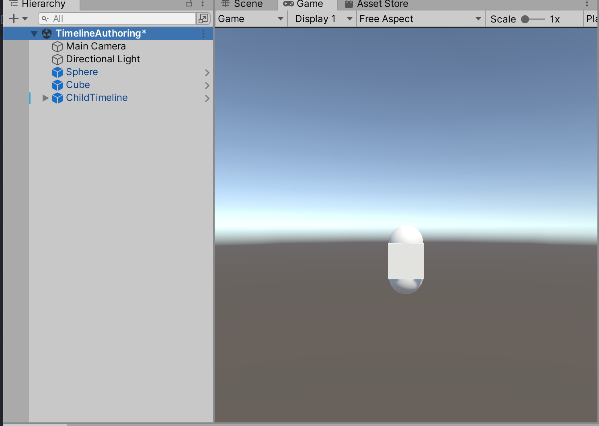
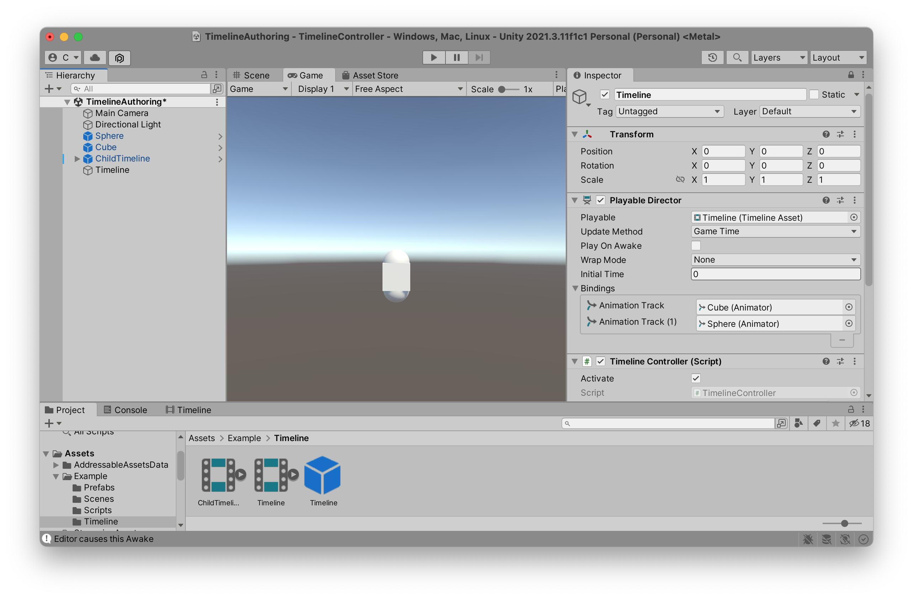
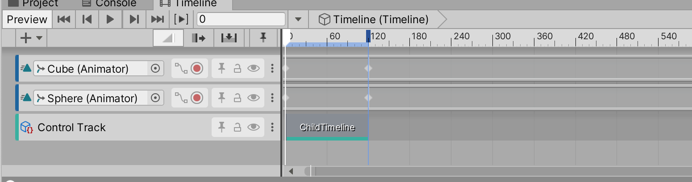
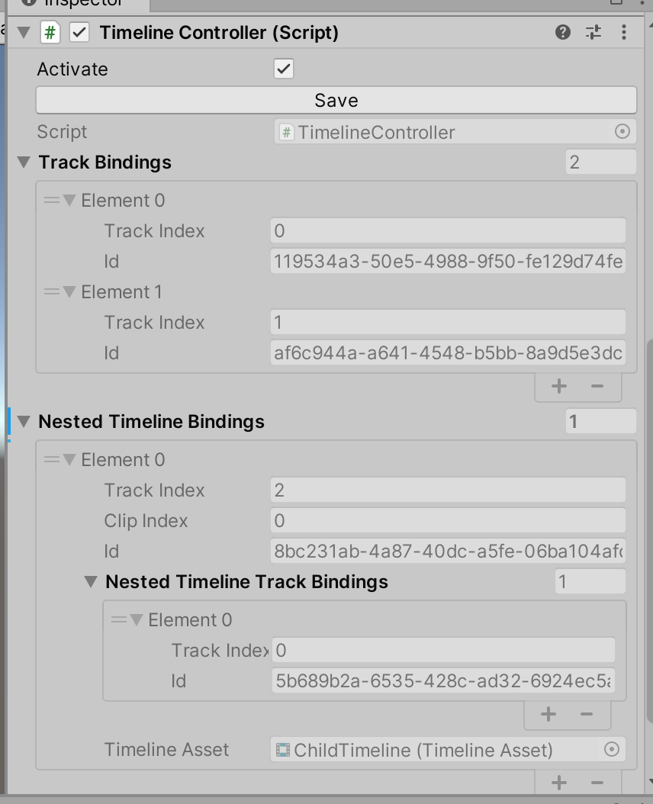

# TimelineController

Unity Timeline is a great tool to create rich content using your game objects, animations, sounds, particles and other scene elements. However, due to its inconvenience of binding runtime objects, it can be quite limited for some game-play heavy scenarios where runtime objects don't exist when timeline is being authored. 

`TimelineController` solves this problem by assigning a unique id to any Prefab or scene GameObject it controls when authoring timeline and saving the associations between timeline track and the unique id.

 In runtime, `TimelineController` finds object by the unique id and bind the object to the associated track using `PlayableDirector.SetGenericBinding`. 
 
 `TimelineController` tries to minimize the friction of usage. You just need add  a `TimelineController` component to a `PlayableDirector` GameObject, then you can author timeline almost like before.

## Workflow

>This is the recommended way not the only way

1. Create a timeline authoring scene

2. Place everything that timeline needs in the authoring scene 


3. Create a GameObject with `PlayableDirector` and `TimelineController` components


4. Edit the timeline


The `TimelineController` component saves all the runtime bindings automatically when editing timeline

5. Save the timeline GameObject as a Prefab

6. Repeat 3-5 for more timelines

7. In runtime, make sure the dependent GameObject exist in memory before playing timeline.

```C#
 // Load dependent GameObjects
cubeHandle = Addressables.LoadAssetAsync<GameObject>("Assets/Example/Prefabs/Cube.prefab");
yield return cubeHandle;
GameObject cube = Instantiate(cubeHandle.Result);

sphereHandle = Addressables.LoadAssetAsync<GameObject>("Assets/Example/Prefabs/Sphere.prefab");
yield return sphereHandle;
// There are multiple instances of the sphere prefab.
// You need select which one to bind or it will bind the instance created first
GameObject sphere1 = Instantiate(sphereHandle.Result);
sphere1.name = "Sphere1";
GameObject sphere2 = Instantiate(sphereHandle.Result);
sphere2.name = "Sphere2";

// Load child timeline
childTimelineHandle = Addressables.LoadAssetAsync<GameObject>("Assets/Example/Prefabs/ChildTimeline.prefab");
yield return childTimelineHandle;
GameObject childTimeline = Instantiate<GameObject>(childTimelineHandle.Result);

// Load timeline GameObject
timelineHandle = Addressables.LoadAssetAsync<GameObject>("Assets/Example/Timeline/Timeline.prefab");
yield return timelineHandle;
var timelineObj = Instantiate(timelineHandle.Result);
var timelineController = timelineObj.GetComponent<TimelineController>();
// Select the instance to bind
timelineController.AddRuntimeObject(sphere2);
// Play the timeline
timelineController.Play(() => Debug.Log("TimelineController Complete"));
}
```
